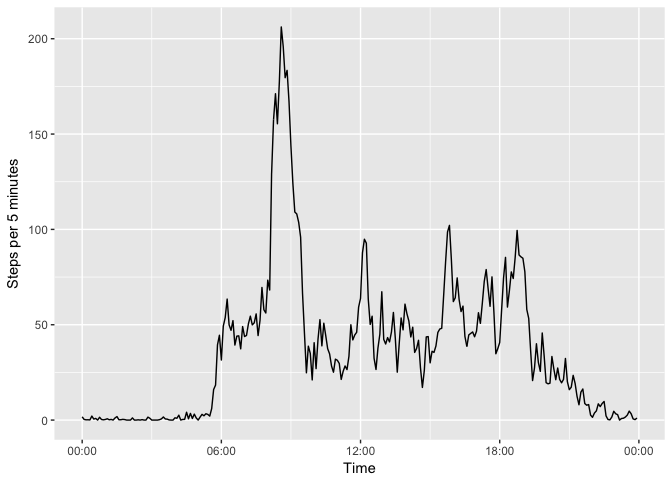
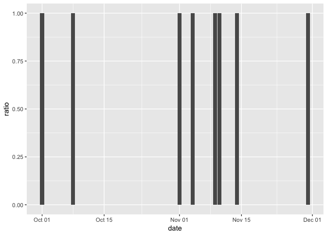

# Reproducible Research: Peer Assessment 1
Márcio Paiva  


## Loading and preprocessing the data

```r
  activity <- read.csv("activity.csv")
  # Minute has an attached date which should be ignored
  activity <- transmute(activity,
    date = as.Date(activity$date),
    minute = as.POSIXct(strptime(paste(
    activity$interval %/% 100,
    activity$interval %% 100, sep = ":"), "%H:%M")),
    steps = steps
  )
```


## What is mean total number of steps taken per day?

```r
  daily_activity <- activity %>% 
    group_by(date) %>%
    summarise(steps = sum(steps, na.rm = TRUE))
  daily_activity %>% ggplot() +
    geom_histogram(
        aes(x = steps),
        boundary = 0,
        binwidth = 1000,
        color = "green") +
    xlab("Steps in day") +
    ylab("Ocurrences") +
    scale_x_continuous(limits = c(0, 24000))
```

<!-- -->

The mean and median for the number of steps in a day:

```r
  mean(daily_activity$steps)
```

```
## [1] 9354.23
```

```r
  median(daily_activity$steps)
```

```
## [1] 10395
```


## What is the average daily activity pattern?

```r
  devise_pattern <- function(activity) {
    activity %>%
      group_by(minute) %>%
      summarise(msteps = mean(steps, na.rm = TRUE))
  }
  
  activity_pattern <- devise_pattern(activity)
  activity_pattern %>%
    ggplot(mapping = aes(x = minute, y = msteps)) +
      geom_line() +
      scale_x_datetime(date_labels = "%H:%M") +
      xlab("Time") +
      ylab("Steps per 5 minutes")
```

<!-- -->

Finding the 5-minute interval with the largest step average across all days.

```r
  max_five_min <- activity_pattern[
    first(order(activity_pattern$msteps, decreasing = TRUE))
    ,]
  format(max_five_min$minute, "%H:%M")
```

```
## [1] "08:35"
```

```r
  max_five_min$msteps
```

```
## [1] 206.1698
```

So the five minute interval with the most average steps was the one starting at 08:35, with an average of 206.17 steps.

## Imputing missing values

### Distribution
Total number of missing values in the dataset:

```r
sum(is.na(activity$steps))
```

```
## [1] 2304
```

For a slightly better understanding of how these missing values are distributed, let's plot the percentage of missing values for each day:

```r
activity %>%
  group_by(date) %>%
  summarise(ratio = sum(is.na(steps))/length(steps)) %>%
  ggplot() +
    geom_col(aes(x = date, y = ratio))
```

<!-- -->

We can see that eight days have no data at all, accounting for all the missing values in the dataset.

Let's substitute the missing values by the mean for that 5 minute interval across all days:

```r
activity <- activity %>% arrange(date, minute)

activity_filled <- activity
activity_filled$steps <- ifelse(
  is.na(activity$steps),
  (merge(activity, activity_pattern, by = "minute") %>%
     arrange(date, minute))$msteps,
  activity$steps
  )
```

The new histogram for steps each day:

```r
  daily_activity_filled <- activity_filled %>% 
    group_by(date) %>%
    summarise(steps = sum(steps, na.rm = TRUE))
  daily_activity_filled %>% ggplot() +
    geom_histogram(
        aes(x = steps),
        boundary = 0,
        binwidth = 1000,
        color = "green") +
    xlab("Steps in day") +
    ylab("Ocurrences") +
    scale_x_continuous(limits = c(0, 24000))
```

<!-- -->

The eight days that were being counted as having zero steps now fall into the same bin.

The new mean and median:

```r
  mean(daily_activity_filled$steps)
```

```
## [1] 10766.19
```

```r
  median(daily_activity_filled$steps)
```

```
## [1] 10766.19
```

## Are there differences in activity patterns between weekdays and weekends?


```r
devise_pattern <- function(activity) {
  activity %>%
    group_by(minute) %>%
    summarise(msteps = mean(steps, na.rm = TRUE))
}

activity$wday = as.POSIXlt(activity$date)$wday
activity_weekdays <- activity %>% filter(wday %in% c(1:5))
activity_weekends <- activity %>% filter(wday %in% c(0,6))

weekdays_pattern <- devise_pattern(activity_weekdays)
weekend_pattern <- devise_pattern(activity_weekends)
weekdays_pattern$label = "Weekdays"
weekend_pattern$label = "Weekends"

ggplot(rbind(weekdays_pattern, weekend_pattern)) +
  geom_line(aes(x = minute, y = msteps, color = label)) +
  guides(color = FALSE) +
  facet_grid(label ~ .) +
  scale_x_datetime(date_labels = "%H:%M") +
  xlab("Time") +
  ylab("Steps per 5 minutes")
```

<!-- -->


